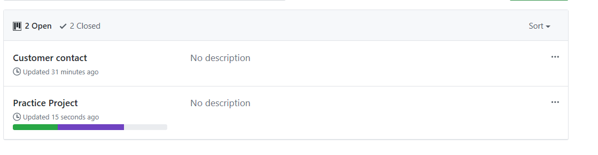
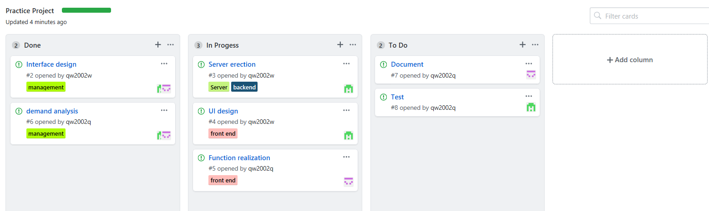

# 软件项目与知识团队管理基础
16340180 
彭仕扬

---

# 一、简答

---

## 分析与设计
分析： &emsp;确定软件开发的总体目标，估计可利用的开发资源、成本、效益、开发进度。分析用户提出的要求，给出用户需求的详细定义，确定软件系统的各项功能、性能需求和设计约束，确定对文档贬值的要求。 
设计： &emsp;把各项软件需求转换成软件的体系结构。结构中的每一个组成部分意义明确，并和某些需求相对应。对按概要设计分解的每个模块所要完成的工作进行具体的描述。 

---

## 面向对象的分析与设计的优势
&emsp; 对对象进行属性分类，符合人的思考方式，软件的实现和理解更为简单。 

---

## UML(统一建模语言)的作用
&emsp; UML是一种开放的方法，用于说明、可视化、构建和编写一个正在开发的、面向对象的、软件密集系统的制品。 
&emsp; 考试范围：用例图、静态图(类图、对象图、包图)、行为图(交互图、状态图、活动图)、实现图（构件图、部署图） 
&emsp; 参考资料：https://www.cnblogs.com/hualiu0/p/5104028.html

---

## 从软件本质的角度，解释软件范围(需求)控制的可行性
&emsp; 软件的本质是一种方式，由于软件本身的复杂性、不可见性、不一致性、可变性，软件范围很多情况下对于客户和开发者都是模糊的。但是这种需求是可以预估和测量的，确定明确的需求作为核心范围，将模糊不定的需求进一步进行评估或暂且放下，是控制软件范围的有效手段。

---

# 二、项目管理实践

---

## 看板(Git Project)
&emsp; Git Project的看板管理分为大方向管理和细化管理 
大方向管理:可以列出项目需要完成的粗略设计 
;
细化管理：对上图所分割的大方向进行更为细化的管理工作。细化具体的工作需求，明确任务阶段和人员分配。 
;
